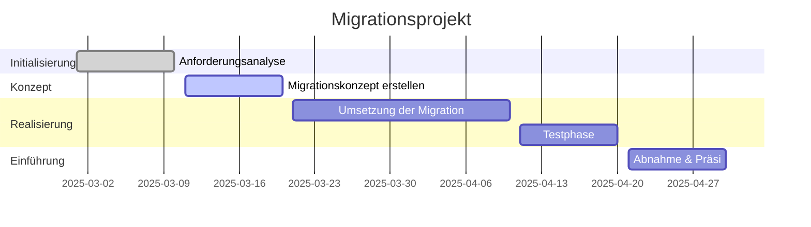

# 🚀 **Projektplan: Migration: Moodle auf Docker**
### 🔍 1.1 Ausgangslage

Eine ältere Moodle-Instanz muss auf die aktuelle Version als Docker-Container migriert werden, inklusive aller Daten. Dies erfolgt im Rahmen des Modulprojekts und wird in mehreren Schritten durchgeführt.

### 🎯 1.2 Ziele

✅ Durchführung der Migration unter Berücksichtigung der HERMES-Projektmanagementmethode  
✅ Erstellung eines Konzeptes mit Konfigurationsmerkmalen und Arbeitspaketen  
✅ Dokumentation der Migration  
✅ Durchführung eines Abnahmetests und Präsentation der Ergebnisse

## ✅ 4. Milestones

- [x]  📌 Anforderungen mit der Lehrperson klären
- [x]  📑 Lastenheft erstellen
- [ ]  📜 Migrationskonzept ausarbeiten
- [ ]  🖥 Testumgebung vorbereiten
- [ ]  🔄 Migration durchführen
- [ ]  🛠 Tests und Validierung der Migrationsergebnisse
- [ ]  📝 Abschlussdokumentation verfassen
- [ ]  🎤 Präsentation vorbereiten

## 🛣 3. Roadmap

