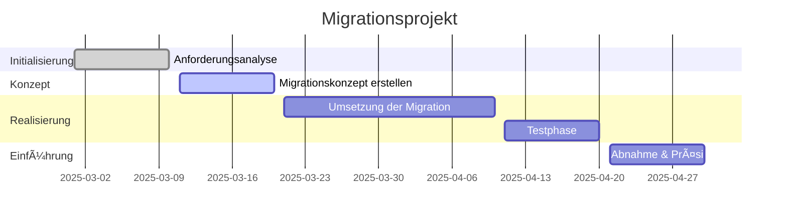

# 🚀 **Projektplan: Migration: Moodle auf Docker**

  
  
  
  

### 🔠1.1 Ausgangslage

Eine ältere Moodle-Instanz muss auf die aktuelle Version als Docker-Container migriert werden, inklusive aller Daten. Dies erfolgt im Rahmen des Modulprojekts und wird in mehreren Schritten durchgeführt.

### 🯠1.2 Ziele

✅ Durchführung der Migration unter Berücksichtigung der HERMES-Projektmanagementmethode  
✅ Erstellung eines Konzeptes mit Konfigurationsmerkmalen und Arbeitspaketen  
✅ Dokumentation der Migration  
✅ Durchführung eines Abnahmetests und Präsentation der Ergebnisse

## ✅ 4. Milestones

- [x]  📌 Anforderungen mit der Lehrperson klären
- [x]  📑 Lastenheft erstellen
- [ ]  📜 Migrationskonzept ausarbeiten
- [ ]  🖥 Testumgebung vorbereiten
- [ ]  🔄 Migration durchführen
- [ ]  🛠 Tests und Validierung der Migrationsergebnisse
- [ ]  📠Abschlussdokumentation verfassen
- [ ]  🤠Präsentation vorbereiten

## 🛣 3. Roadmap

```mermaid
gantt
    title Migrationsprojekt
    dateFormat  YYYY-MM-DD
    section Initialisierung
    Anforderungsanalyse :done, 2025-03-01, 2025-03-10
    section Konzept
    Migrationskonzept erstellen :active, 2025-03-11, 2025-03-20
    section Realisierung
    Umsetzung der Migration :2025-03-21, 2025-04-10
    Testphase :2025-04-11, 2025-04-20
    section Einführung
    Abnahme & Präsi :2025-04-21, 2025-04-30
```
